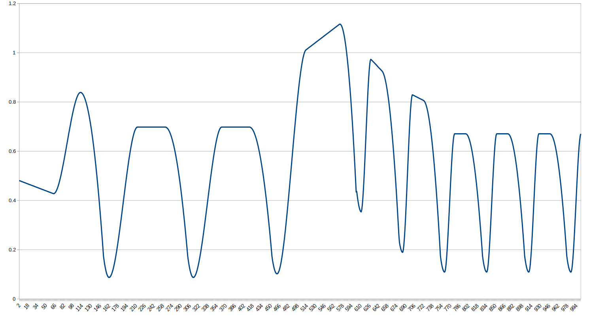

# Nullspace_Projection
Robot 양팔 충돌회피 알고리즘 (Nullspace Projection)

**여유 자유도(Redundancy)란?**

- 로봇 매니퓰레이터의 자유도(DOF, Degrees of Freedom)란?
    - 3D 공간에서 손을 원하는 위치에 배치하려면 **최소 6개의 자유도(3개 위치 + 3개 방향)**가 필요함.
    - 만약 7개 이상의 자유도(예: 7DOF, 9DOF)를 가진다면 **여유 자유도(Redundancy)가 존재**함.
- **여유 자유도를 활용하는 이유**
    - **목표 동작을 수행하면서도 추가적인 회피 동작을 실행할 수 있음**
    - 특정 경로 제한을 가지는 환경에서도 유연한 동작 가능
    - Null-space에서 보정 동작을 수행하여 충돌 방지 가능

**충돌 회피 알고리즘의 핵심 개념**

**(1) 기본 목표 동작 수행**

로봇의 기본 동작을 유지하기 위해 **목표 위치(End-effector)를 추종하는 속도**를 계산합니다.

q˙primary=J†x˙target\dot{\mathbf{q}}_{\text{primary}} = J^{\dagger} \dot{\mathbf{x}}_{\text{target}}

q˙primary=J†x˙target

- J†J^{\dagger}J† : Jacobian의 유사 역행렬 (Pseudo-inverse)
- x˙target\dot{\mathbf{x}}_{\text{target}}x˙target : 목표 위치로 이동하기 위한 속도 벡터

**(2) 충돌 회피 동작 추가 (Null-space Projection)**

충돌을 회피하는 방향으로 Null-space에서 추가적인 움직임을 적용합니다.

N=I−J†JN = I - J^{\dagger} J

N=I−J†J

q˙avoid=Nkavoid\dot{\mathbf{q}}_{\text{avoid}} = N \mathbf{k}_{\text{avoid}}

q˙avoid=Nkavoid

- NNN : Null-space Projection 행렬 (Jacobian이 작업 공간을 방해하지 않는 보조 움직임을 결정)
- kavoid\mathbf{k}_{\text{avoid}}kavoid : 회피 행동을 위한 추가 관절 속도 벡터

최종적으로, 로봇의 관절 속도는 다음과 같이 계산됩니다.

q˙=q˙primary+q˙avoid\dot{\mathbf{q}} = \dot{\mathbf{q}}_{\text{primary}} + \dot{\mathbf{q}}_{\text{avoid}}

q˙=q˙primary+q˙avoid

즉, **목표 동작을 방해하지 않으면서 Null-space에서 충돌 회피 행동을 추가**하는 방식입니다.

<pre>
Eigen::VectorXd PathManager::avoidCollisionAndAdjustAngles(Eigen::VectorXd& Qf, const Eigen::VectorXd& Qi, Eigen::VectorXd& wristR, Eigen::VectorXd& wristL) {
    // 팔의 최소 거리 기준 (0.01m)
    double minDistance = 0.01;
    
    if (checkCollision(wristR, wristL, minDistance)) {
        // 충돌 회피 벡터 (반대 방향으로 이동하도록 설정)
        Eigen::Vector3d avoidanceDirection = (wristR - wristL).normalized();
        wristR += 0.05 * avoidanceDirection;
        wristL -= 0.05 * avoidanceDirection;

        // // Jacobian 계산
        // Eigen::MatrixXd J(6, 9);  // Jacobian 행렬
        // J.setRandom();  // 랜덤한 Jacobian 값 (실제 로봇 Jacobian 사용)
        Eigen::MatrixXd J = computeJacobian(Qf);
        Eigen::MatrixXd J_inv = J.completeOrthogonalDecomposition().pseudoInverse();
        
        // 회피 속도 생성 (회피 방향으로 이동)
        Eigen::VectorXd dq_avoid = Eigen::VectorXd::Zero(Qf.size());
        dq_avoid.head(3) = 0.05 * avoidanceDirection;
        
        // Null-space projection 적용하여 기존 이동을 방해하지 않도록 보정
        Eigen::VectorXd dq_adjusted = (Eigen::MatrixXd::Identity(Qf.size(), Qf.size()) - J_inv * J) * dq_avoid;
        
        // 최종 수정된 Qf 적용
        Qf += dq_adjusted;
    }
    return Qf;
}

Eigen::MatrixXd PathManager::computeJacobian(const Eigen::VectorXd& Q) {
    Eigen::MatrixXd J = Eigen::MatrixXd::Zero(3, Q.size());
    
    // Jacobian 행렬 초기화 (간단한 예제, 필요에 따라 수정 가능)
    for (int i = 0; i < Q.size(); ++i) {
        J(0, i) = -sin(Q(i)); // x 변화에 대한 영향, 사용자 정의
        J(1, i) = cos(Q(i));  // y 변화에 대한 영향, 사용자 정의
        J(2, i) = 1.0;        // z 변화에 대한 영향, 사용자 정의
    }
    
    return J;
}

bool PathManager::checkCollision(const Eigen::VectorXd& wrist1, const Eigen::VectorXd& wrist2, double minDistance) {
    double distance = (wrist1 - wrist2).norm();
    return distance < minDistance;
}
</pre>

---

---

>> 참고 논문: **여유 자유도를 이용한 두 팔 로봇 매니퓰레이터의 충돌 회피 알고리즘** 
An Algorithm for Collision Avoidance of Two-Arm Robot Manipulator Using Redundancy
